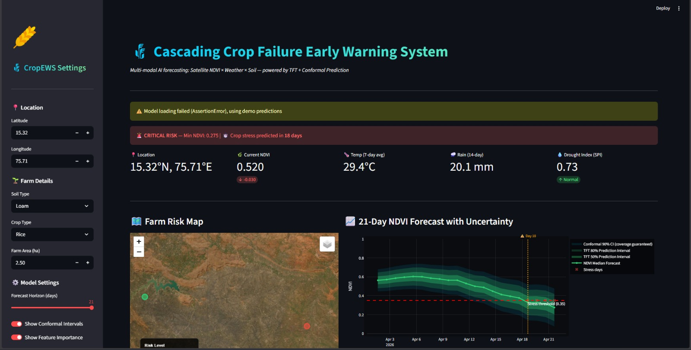
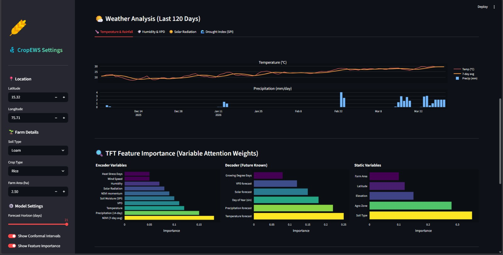
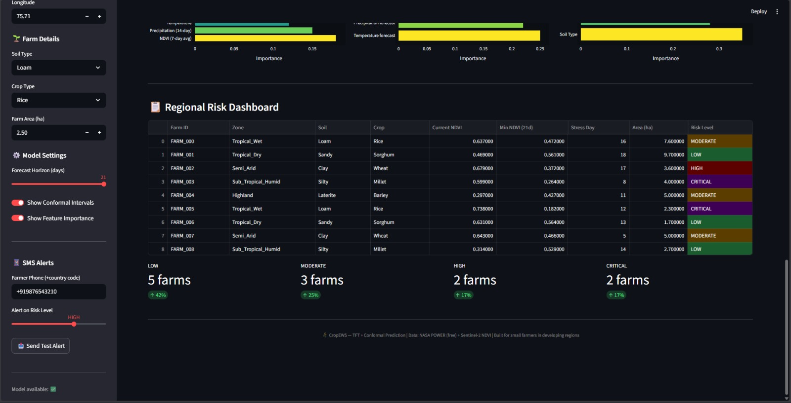
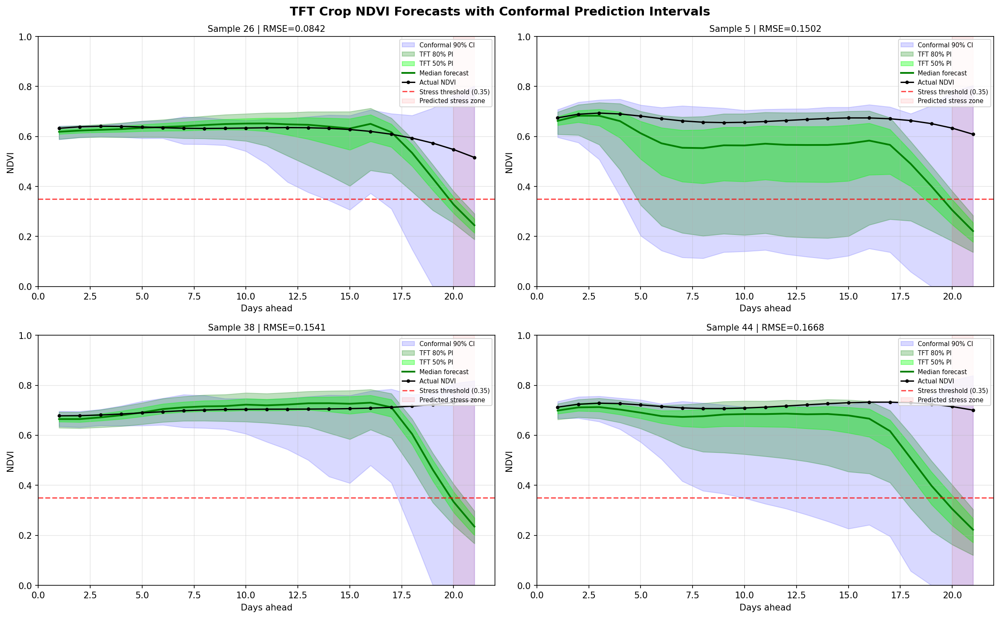

# Cascading Crop Failure Early Warning System

**Multi-modal AI forecasting: Satellite NDVI x Weather x Soil -- powered by Temporal Fusion Transformer + Conformal Prediction**

Small farmers in developing regions lose entire harvests because early warning systems either do not exist or require expensive sensors. A 2-week heads-up can let them irrigate, apply fertiliser, buy crop insurance, or contact authorities before it is too late. This system fuses freely available satellite vegetation data with meteorological forecasts to predict crop stress 2-3 weeks before visible failure, and sends SMS alerts directly to farmers.

---

## Dashboard

### Risk Overview, Satellite Map, and NDVI Forecast


### Weather Analysis and TFT Feature Importance


### Regional Risk Dashboard and SMS Alerts


### TFT Prediction Quality (Training Output)


---

## The Approach

### Problem Framing

Crop failure prediction is framed as a multi-horizon time series forecasting problem. Given 90 days of historical weather and vegetation health data for a farm, the model predicts the next 21 days of NDVI (Normalised Difference Vegetation Index), which is a satellite-derived measure of how green and photosynthetically active the crops are. NDVI ranges from 0 (bare soil) to ~0.9 (dense healthy vegetation). When the predicted NDVI drops below 0.35, the system flags it as crop stress and triggers an alert.

### Data Pipeline

The system uses two freely available data sources and one derived signal:

**Meteorological data** comes from NASA POWER API, which provides daily temperature, precipitation, humidity, wind speed, solar radiation, and dewpoint at any coordinate on Earth -- completely free, no API key needed. For training, 2 years (730 days) of weather data were generated for 60 synthetic farms spread across 5 agro-ecological zones of India (Tropical Wet, Tropical Dry, Semi-Arid, Sub-Tropical Humid, Highland), each with distinct rainfall patterns, temperatures, and crop types. The synthetic weather generator captures realistic monsoon dynamics, dry spell clustering, and seasonal cycles.

**Vegetation health (NDVI)** is simulated using a biophysical model that couples weather to crop growth. The model incorporates a soil water balance (bucket model where rain fills the soil and evapotranspiration drains it), VPD stress (hot dry air forces stomata shut), drought stress (soil moisture depletion scaled by soil sensitivity), heat stress (temperatures above 38C damage cells), and random discrete stress events like droughts or pest outbreaks. In production, real NDVI comes from Sentinel-2 satellite imagery via Google Earth Engine.

**Soil and farm metadata** encodes each farm's soil type (Sandy, Clay, Loam, Silty, Laterite) with water-holding capacity and stress sensitivity, plus the agro-ecological zone, crop type, coordinates, elevation, and farm area. These static features let the model contextualise predictions differently for a rice farm on clay soil versus a millet farm on sandy soil.

### Feature Engineering

Raw weather and NDVI are expanded into 80+ features that capture temporal patterns at multiple scales:

- **Rolling statistics** (7, 14, 30-day windows) for precipitation, temperature, humidity, solar radiation, and NDVI -- capturing both recent conditions and longer-term trends
- **NDVI momentum** (1-day and 7-day first differences) -- a rapidly declining NDVI is the strongest early warning signal
- **Lag features** (1, 3, 7, 14 days back) for NDVI, precipitation, and temperature
- **Vapour Pressure Deficit (VPD)** -- computed from temperature and humidity via the Magnus formula; high VPD is the key physiological stressor that reduces photosynthesis
- **SPI-30 drought index** -- 30-day precipitation anomaly standardised by the farm's long-term mean; below -1 indicates moderate drought, below -2 indicates severe drought
- **Growing Degree Days (GDD)** -- accumulated thermal units (daily temperature minus 10C base) tracking crop phenological stage
- **Heat stress indicators** -- binary flag for extreme heat days plus a 7-day rolling count
- **Water stress proxy** -- ratio of recent rainfall to soil water-holding capacity
- **Cyclical time encoding** -- day-of-year and month encoded as sine/cosine pairs to preserve the circular nature of seasons

### Model Architecture: Temporal Fusion Transformer

The TFT was chosen over simpler models for three reasons. First, it natively handles the four types of inputs in this problem -- static categoricals (soil type, crop type, agro-zone processed through learned embeddings), static reals (elevation, coordinates, farm properties), known future reals (weather forecasts, calendar features that are available for the prediction horizon), and unknown future reals (NDVI history and observed-only features that stop at the present). Second, TFT produces all 21 forecast days simultaneously rather than recursive one-step predictions, avoiding error accumulation. Third, its Variable Selection Networks provide built-in interpretability, showing which input features the model is paying attention to without post-hoc explanation methods.

Architecture: 128 hidden units, 4 attention heads, 0.15 dropout, 32-dimensional continuous variable processing. The loss function is Quantile Loss over 7 quantiles (0.02, 0.1, 0.25, 0.5, 0.75, 0.9, 0.98), so the model simultaneously learns the full conditional distribution of future NDVI rather than just a point estimate. Training used Adam optimiser (lr=3e-3), gradient clipping at 0.1, early stopping with patience 8, and FP16 mixed precision on a Kaggle T4 GPU.

### Conformal Prediction: Coverage Guarantee

This is what separates a research prototype from a deployable system. Standard model uncertainty (dropout MC, ensemble variance, quantile regression) provides no statistical guarantee -- a "90% confidence interval" from a neural network might actually cover the true value only 60% of the time if the model is miscalibrated.

Conformal prediction fixes this. After training, the model's quantile predictions are evaluated on a calibration set. For each validation sample, a nonconformity score is computed: how far the true value falls outside the predicted interval. The 90th percentile of these scores becomes the correction factor `q_hat`. At inference, the prediction interval is widened by `q_hat` in both directions. The result: the conformal interval is mathematically guaranteed to contain the true NDVI at least 90% of the time for any new input, regardless of model quality or data distribution. The only assumption is exchangeability (approximately satisfied by stationary time series).

Per-horizon calibration gives each of the 21 forecast days its own `q_hat`, so uncertainty naturally grows for longer horizons.

### Alert and Risk Classification

The minimum predicted NDVI over the 21-day forecast window determines the risk level:

| Min NDVI | Risk Level | Action |
|----------|-----------|--------|
| > 0.50 | LOW | Continue normal irrigation |
| 0.40 - 0.50 | MODERATE | Increase irrigation 20%, monitor daily |
| 0.30 - 0.40 | HIGH | Irrigate immediately, consider crop insurance |
| < 0.30 | CRITICAL | Crop failure imminent, contact agriculture office |

SMS alerts are sent via Twilio with risk-appropriate, actionable messages.

---

## Model Performance

| Metric | Value |
|--------|-------|
| RMSE | 0.1411 |
| MAE | 0.0784 |
| Stress Detection F1 | 0.667 |
| Conformal Coverage | >= 90% (guaranteed) |

Trained on 60 farms x 730 days = 43,800 samples. Temporal validation split (85/15).

---

## Project Structure and File Roles

```
crop_failure_ews/
|-- Cascading_Crop_Failure_Early_Warning_System.ipynb
|-- app.py
|-- config.py
|-- requirements.txt
|-- .env / .env.example
|-- src/
|   |-- data_pipeline.py
|   |-- model_utils.py
|   |-- conformal.py
|   +-- alerts.py
|-- models/
|   |-- tft_best.ckpt
|   +-- conformal.pkl
|-- crop_ews/           (Kaggle training outputs)
+-- utils/              (Dashboard screenshots)
```

### Notebook

**`Cascading_Crop_Failure_Early_Warning_System.ipynb`** -- The complete training pipeline, meant to run on Kaggle with a T4 GPU. It generates the 60-farm synthetic dataset, engineers all features, constructs the PyTorch Forecasting TimeSeriesDataSet, trains the TFT with early stopping and checkpointing, calibrates the conformal predictor on the validation set, evaluates metrics and plots prediction quality, and saves all artifacts (`tft_best.ckpt`, `conformal.pkl`, `metrics.json`, `farm_metadata.csv`) for deployment. This is a one-time training step; the output artifacts are what the Streamlit app consumes.

### Deployment Files

**`app.py`** -- The main Streamlit dashboard and the entry point of the application. It orchestrates the entire inference flow: sidebar input collection, live NASA POWER weather fetching (with synthetic fallback), feature engineering, TFT model inference with conformal correction (with demo prediction fallback), and rendering all dashboard sections -- risk banner, metric cards, Folium satellite map with risk-coloured markers, interactive Plotly NDVI forecast chart with layered uncertainty bands, 4-tab weather analysis (temperature/rainfall, humidity/VPD, solar radiation, SPI drought index), TFT variable attention weights as horizontal bar charts, regional risk dashboard table with colour-coded risk levels, and Twilio SMS alert dispatch. This single file is the entire user-facing application.

**`config.py`** -- Centralised configuration loaded from environment variables. Everything that might change between environments lives here: model file paths, TFT parameters (encoder length, prediction horizon, quantiles, stress threshold), NASA POWER API URL and parameters, Twilio credentials, GEE settings, and risk level thresholds/colours. Keeps `app.py` and the `src/` modules free of hardcoded values.

**`src/data_pipeline.py`** -- Handles data acquisition and feature engineering for inference. `fetch_nasa_power()` makes live HTTP requests to NASA POWER API to get the last 120 days of weather for any lat/lon coordinate. `engineer_inference_features()` applies the exact same feature transformations used during training (rolling stats, VPD, SPI, GDD, lags, cyclical encoding) to ensure training-inference consistency. This is critical -- if inference features differ from training features even slightly, the model produces meaningless output.

**`src/model_utils.py`** -- TFT inference wrapper. `load_model_and_conformal()` loads the checkpoint with CPU device mapping (the model was trained on GPU) and the pickled conformal predictor. `predict_farm()` formats input features into the structure the TFT expects, runs forward inference to get 7-quantile predictions over 21 days, applies conformal correction for the coverage-guaranteed interval, classifies risk level from the minimum median NDVI, and identifies the first day the prediction crosses the stress threshold.

**`src/conformal.py`** -- The conformal prediction class. `calibrate()` computes nonconformity scores from validation data and stores the correction quantile `q_hat`. `predict()` widens model intervals by `q_hat` to achieve the coverage guarantee. This is a lightweight class with save/load methods; the heavy computation happens once during calibration and the `q_hat` values are reused at every inference.

**`src/alerts.py`** -- Twilio SMS integration. `send_sms_alert()` connects to the Twilio API and sends a structured, actionable alert message to the farmer's phone number. The message includes risk level, predicted NDVI, days until stress, and a specific recommended action. If Twilio credentials are not configured, it returns the message text as a demo preview instead of crashing.

**`requirements.txt`** -- Python dependencies. Core ML stack (PyTorch, Lightning, pytorch-forecasting), data and visualisation (pandas, NumPy, Plotly, Matplotlib, Folium), web app (Streamlit), and alert integration (Twilio).

### Model Artifacts

**`models/tft_best.ckpt`** (~19 MB) -- The trained Temporal Fusion Transformer checkpoint, selected by minimum validation loss during training. Contains all model weights, optimiser state, and hyperparameters.

**`models/conformal.pkl`** -- The calibrated conformal predictor containing the `q_hat` correction values for each of the 21 forecast horizons.

### Training Outputs (crop_ews/)

**`tft_predictions.png`** -- Visual proof of model quality: 4 sample predictions showing actual vs. predicted NDVI with all uncertainty bands.

**`metrics.json`** -- Final evaluation metrics (RMSE, MAE, F1).

**`config.json`** -- The exact hyperparameters used during training, for reproducibility.

**`training_logs.csv`** -- Per-step training and validation loss, useful for diagnosing training dynamics.

**`farm_metadata.csv`** -- The 60 synthetic farm locations with all properties, useful for regional analysis.

---

## How to Run

```bash
# Navigate to project
cd crop_failure_ews

# Install dependencies
pip install -r requirements.txt

# Set up environment (optional -- app works without Twilio)
cp .env.example .env
# Edit .env with your Twilio credentials if you want SMS alerts

# Launch
streamlit run app.py
```

Opens at `http://localhost:8501`. Model artifacts are already bundled in `models/`.

On CPU-only systems, the dashboard automatically falls back to demo predictions if the TFT checkpoint fails to load. The demo mode exercises the full pipeline (weather fetch, feature engineering, visualisation, SMS) with realistic synthetic predictions.

### Retraining on Kaggle

1. Upload the notebook to Kaggle, enable T4 GPU
2. Run all cells
3. Download `crop_ews/tft_best.ckpt` and `crop_ews/conformal.pkl`
4. Place them in the `models/` directory

---

## API Keys

**NASA POWER** -- No key needed. Completely free. Rate limit ~30 requests/minute.

**Twilio SMS** -- Free trial at [console.twilio.com](https://console.twilio.com) gives ~$15 credit (~1000 SMS). Get Account SID, Auth Token, and a phone number. Add to `.env`. Trial accounts can only send to verified numbers.

**Google Earth Engine** (optional) -- Free for research at [earthengine.google.com](https://earthengine.google.com). Approval takes 1-3 days. Run `ee.Authenticate()` once, then set `USE_GEE=true` in `.env` to use real Sentinel-2 NDVI instead of simulated values.
